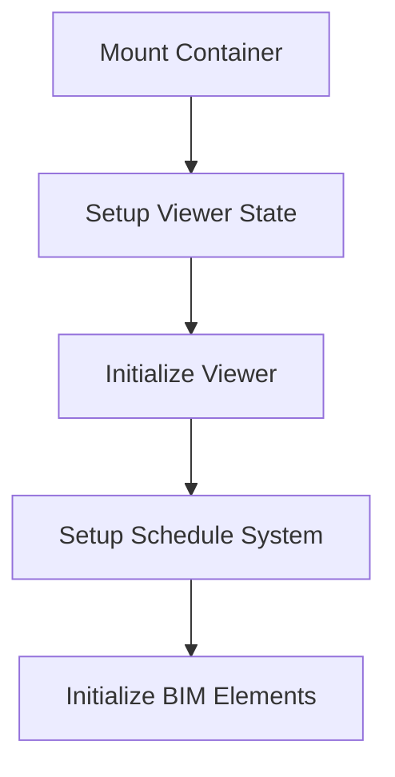

# Schedule System Implementation Update

architecture.md - Added viewer initialization chain and error handling patterns
implementation.md - Updated current status and next steps
instructions-to-start.md - Added step-by-step instructions

## Current Status

We've identified several critical issues in the viewer initialization chain:

1. Viewer State Access

```typescript
// Current issue
const { viewer } = useInjectedViewer() // Fails because inject() timing
```

2. Container Initialization

```typescript
// Current issue
GL_INVALID_FRAMEBUFFER_OPERATION: Framebuffer incomplete
```

3. State Management

```typescript
// Current issue
Cannot destructure property 'viewer' of 'useInjectedViewerState(...)'
```

## Required Changes

### 1. Viewer Container Management

```typescript
// New approach
const viewerContainer = ref<HTMLElement | null>(null)

// Ensure container is ready before initialization
onMounted(() => {
  if (!viewerContainer.value) {
    throw new Error('Viewer container not mounted')
  }
  // Initialize viewer with container
})
```

### 2. State Initialization Chain



### 3. Error Handling Improvements

```typescript
// Add error boundaries
const handleError = (err: Error | unknown) => {
  const errorValue = err instanceof Error ? err : new Error(String(err))
  error.value = errorValue
  debug.error(DebugCategories.ERROR, 'Schedule error:', errorValue)
}

// Add recovery mechanisms
const handleRecovery = async () => {
  error.value = null
  await reinitializeViewer()
}
```

## Implementation Steps

### 1. Update Core Files

#### useViewerInitialization.ts

- Add container management
- Improve error handling
- Add retry mechanism
- Add state validation

#### useScheduleSetup.ts

- Update viewer state handling
- Add container validation
- Improve error recovery
- Add initialization guards

#### Schedules.vue

- Move viewer initialization to setup
- Add container refs
- Improve error boundaries
- Add recovery UI

### 2. Update Architecture

#### State Flow

- Ensure proper initialization order
- Add state validation
- Improve error recovery
- Add state debugging

#### Component Communication

- Add error boundaries
- Improve state flow
- Add recovery mechanisms
- Improve debugging

### 3. Add Error Recovery

#### Viewer Errors

- Add retry mechanism
- Add fallback states
- Improve error messages
- Add recovery UI

#### State Errors

- Add state validation
- Add recovery mechanisms
- Improve error handling
- Add debugging tools

## Testing Requirements

### 1. Initialization Tests

- Test container mounting
- Test viewer initialization
- Test state flow
- Test error handling

### 2. Error Recovery Tests

- Test retry mechanism
- Test state recovery
- Test UI recovery
- Test error boundaries

### 3. Integration Tests

- Test full initialization flow
- Test error scenarios
- Test recovery paths
- Test state management

## Success Criteria

### 1. Initialization

- [ ] Container mounts successfully
- [ ] Viewer initializes properly
- [ ] State flows correctly
- [ ] No timing issues

### 2. Error Handling

- [ ] Clear error messages
- [ ] Proper recovery mechanisms
- [ ] State consistency
- [ ] User feedback

### 3. Performance

- [ ] Fast initialization
- [ ] Smooth recovery
- [ ] No memory leaks
- [ ] Good error reporting

## Documentation Updates

### 1. Architecture

- Update initialization flow
- Document error handling
- Add recovery patterns
- Update state flow

### 2. Implementation

- Add container management
- Update error handling
- Document recovery
- Add debugging guide

### 3. Testing

- Add test scenarios
- Document error cases
- Add recovery tests
- Update integration tests

## Next Steps

1. Immediate

- [ ] Fix viewer injection timing
- [ ] Add container management
- [ ] Improve error handling
- [ ] Add recovery UI

2. Short Term

- [ ] Add comprehensive tests
- [ ] Improve documentation
- [ ] Add debugging tools
- [ ] Enhance error reporting

3. Long Term

- [ ] Optimize performance
- [ ] Add monitoring
- [ ] Improve DX
- [ ] Add analytics

## Migration Guide

### 1. For Developers

- Update initialization code
- Add error handling
- Test recovery paths
- Update documentation

### 2. For Code Review

- Check initialization order
- Verify error handling
- Test recovery paths
- Review documentation

### 3. For Testing

- Add initialization tests
- Add error tests
- Add recovery tests
- Update integration tests
