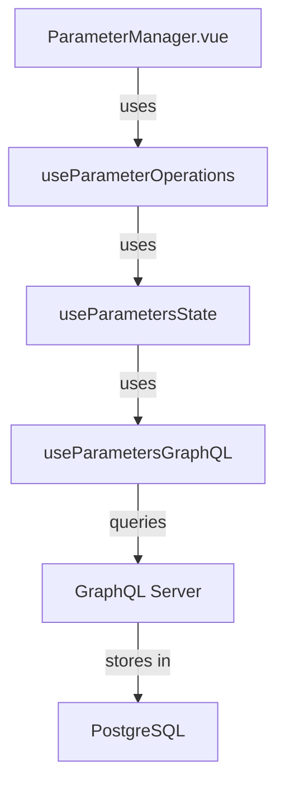

# Parameter System Flow

## Component Flow



## Data Flow

1. UI Layer (ParameterManager.vue)

```
- Displays parameters in groups
- Handles user interactions
- Emits events for CRUD operations
```

2. Operations Layer (useParameterOperations)

```
- Business logic
- Parameter validation
- ID generation
- Error handling
```

3. State Layer (useParametersState)

```
- Manages local state
- Watches for remote changes
- Converts between Parameter types
```

4. API Layer (useParametersGraphQL)

```
- GraphQL queries and mutations
- Data fetching
- Error handling
```

## Current Issues

1. Parameters Not Showing

```
Problem: Wrong GraphQL query path
Location: useParametersGraphQL.ts
Fix: Update query to use activeUser.parameters
```

2. Parameters Being Overwritten

```
Problem: State sync issues
Location: useParametersState.ts
Fix: Proper state management and merging
```

3. ID Generation Conflicts

```
Problem: Multiple places generating IDs
Location: Multiple files
Fix: Centralize ID generation
```

## Data Types

1. Raw Parameter (from GraphQL)

```typescript
interface Parameter {
  id: string
  name: string
  type: ParameterType
  value: string
  group: string
  // ...other fields
}
```

2. Unified Parameter (internal)

```typescript
interface UnifiedParameter {
  id: string
  name: string
  type: ParameterType
  value: unknown
  currentGroup: string
  computed?: {
    value: unknown
    isValid: boolean
  }
  // ...other fields
}
```

## State Management

1. Local State

```typescript
const parameters = ref<Record<string, UnifiedParameter>>({})
```

2. Remote State Sync

```typescript
watch(
  () => parametersResult.value?.activeUser?.parameters,
  (newParameters) => {
    // Convert and merge parameters
  }
)
```

## Implementation Steps

1. Fix GraphQL Layer

- Update queries to use correct paths
- Implement proper error handling
- Add type safety

2. Fix State Management

- Implement proper state syncing
- Handle parameter merging
- Add validation

3. Fix Operations Layer

- Centralize ID generation
- Add proper validation
- Improve error handling

4. Fix UI Layer

- Update component to handle new state
- Improve error display
- Add loading states

## Testing Strategy

1. Unit Tests

```typescript
// Test parameter conversion
test('converts GraphQL parameter to UnifiedParameter', () => {
  // ...
})

// Test state management
test('merges parameters without overwrites', () => {
  // ...
})
```

2. Integration Tests

```typescript
// Test full flow
test('creates parameter and updates UI', async () => {
  // ...
})
```

## Error Handling

1. GraphQL Errors

```typescript
class ParameterError extends Error {
  constructor(message: string, public cause?: Error) {
    super(message)
    this.name = 'ParameterError'
  }
}
```

2. Validation Errors

```typescript
class ParameterValidationError extends ParameterError {
  constructor(message: string) {
    super(message)
    this.name = 'ParameterValidationError'
  }
}
```

## Next Steps

1. Update useParametersGraphQL.ts

- Fix query paths
- Implement proper error handling
- Add type safety

2. Update useParametersState.ts

- Fix state syncing
- Implement proper merging
- Add validation

3. Update useParameterOperations.ts

- Centralize ID generation
- Add validation
- Improve error handling

4. Update ParameterManager.vue

- Handle new state management
- Improve error display
- Add loading states
