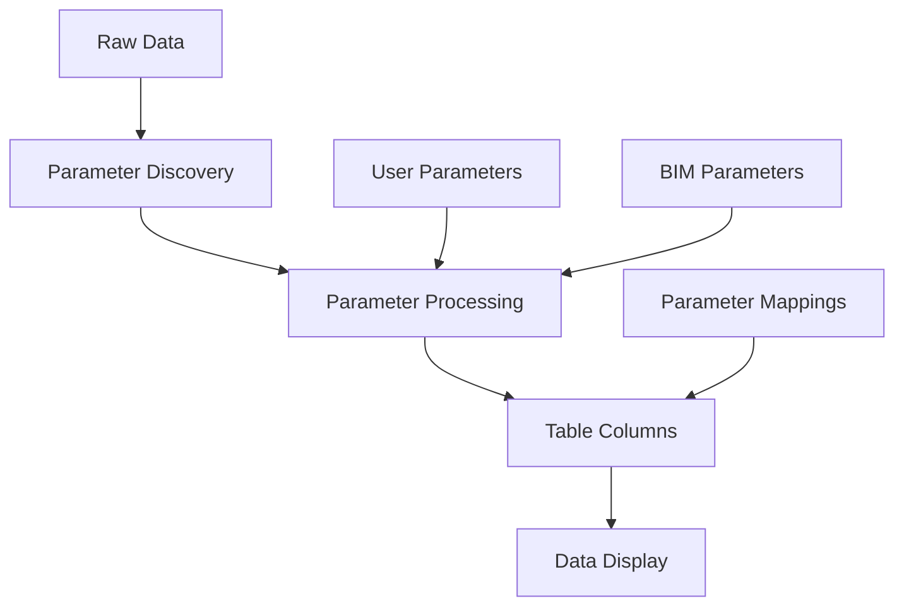
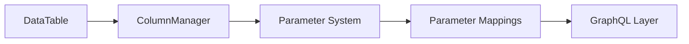
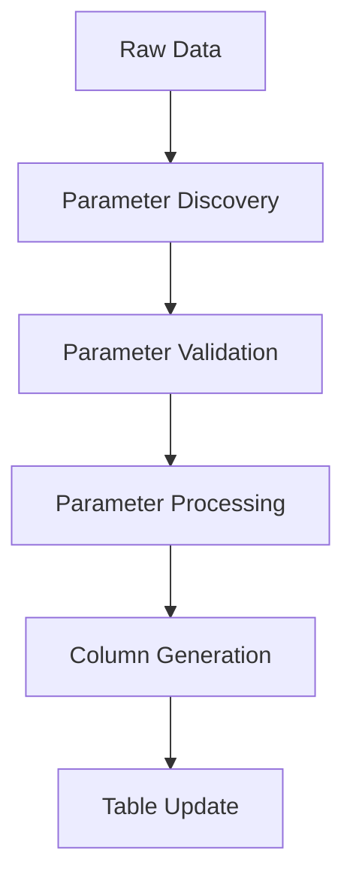

# Parameter System Architecture

## 1. Core Components & Data Flow



## 2. System Components

### Data Layer

```
ElementData
├── id: string
├── parameters: Record<string, unknown>
└── metadata: Record<string, unknown>
```

### Parameter Types

```typescript
interface Parameter {
  id: string
  field: string
  name: string
  type: string
  header?: string
  visible?: boolean
  removable?: boolean
}

interface BimParameter extends Parameter {
  sourceValue: unknown
  fetchedGroup: string
  currentGroup: string
}

interface UserParameter extends Parameter {
  equation: string
  category: string
}
```

### Table Structure

```typescript
interface TableConfig {
  id: string
  name: string
  columns: ColumnDef[]
  parameters: Parameter[]
}

interface ColumnDef {
  id: string
  field: string
  header: string
  type: string
  visible: boolean
  parameterRef?: string
}
```

## 3. Component Relationships

### Core Components



### Parameter Processing Flow



## 4. State Management

### Parameter State

```typescript
interface ParameterState {
  definitions: Record<string, Parameter>
  mappings: ParameterMappings
  processed: Record<string, ProcessedParameter>
}
```

### Table State

```typescript
interface TableState {
  columns: ColumnDef[]
  visibleColumns: ColumnDef[]
  data: ElementData[]
  processedData: ElementData[]
}
```

## 5. Proposed Organization

### Core (Shared) Components

```
frontend-2/
└── components/
    └── core/
        ├── tables/
        │   ├── DataTable/
        │   └── ColumnManager/
        └── parameters/
            ├── ParameterManager/
            └── shared/
```

### Viewer-Specific Components

```
frontend-2/
└── components/
    └── viewer/
        ├── schedules/
        │   └── components/
        └── parameters/
            └── BimParameters/
```

### Composables Structure

```
frontend-2/
└── composables/
    ├── core/
    │   ├── tables/
    │   │   ├── useTableState.ts
    │   │   └── useTableOperations.ts
    │   └── parameters/
    │       ├── useParameterMappings.ts
    │       └── useParameterOperations.ts
    └── viewer/
        └── parameters/
            └── useBimParameters.ts
```

## 6. Key Interactions

1. Parameter Discovery:

   - Raw data analyzed for parameters
   - BIM parameters automatically discovered
   - User parameters manually defined
   - Parameters categorized and grouped

2. Parameter Processing:

   - Parameters validated and normalized
   - Values processed according to type
   - Equations evaluated for user parameters
   - Results cached for performance

3. Table Integration:

   - Parameters mapped to columns
   - Column definitions generated
   - Data processed for display
   - State updates managed

4. State Management:
   - Parameter state centrally managed
   - Table state synchronized
   - Changes persisted via GraphQL
   - UI updates triggered

## 7. Implementation Considerations

1. Performance:

   - Parameter discovery optimized
   - Processing results cached
   - State updates batched
   - Lazy loading where possible

2. Type Safety:

   - Strong typing throughout
   - Runtime type validation
   - Error boundaries defined
   - Type guards implemented

3. Extensibility:

   - Plugin architecture for parameters
   - Custom parameter types supported
   - Processing pipeline extensible
   - State management modular

4. Maintainability:
   - Clear component boundaries
   - Documented interfaces
   - Testable units
   - Consistent patterns
