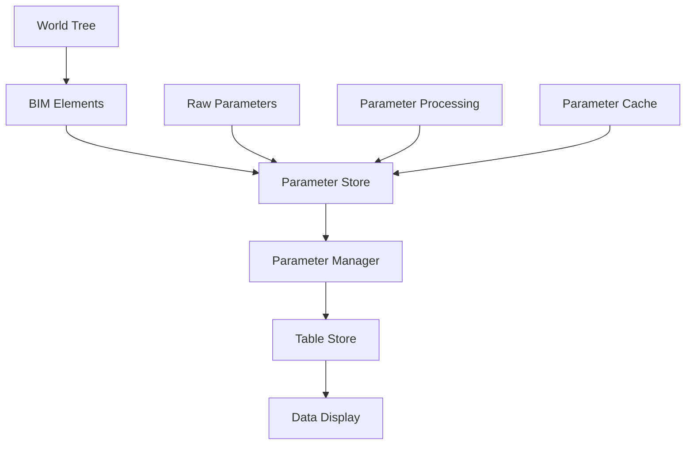
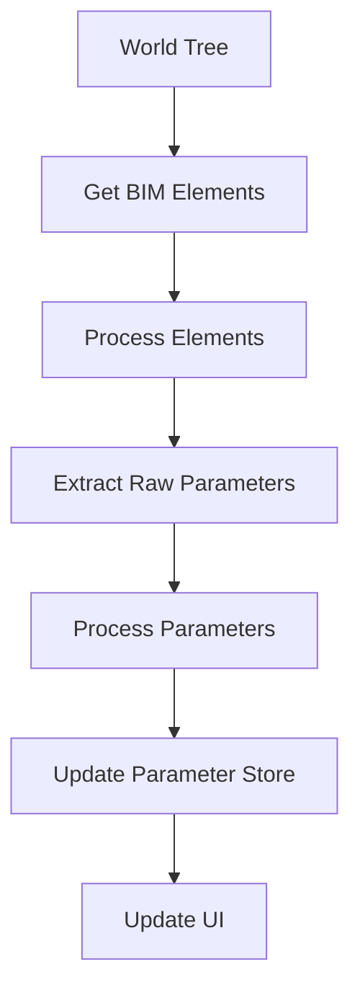

# Parameter System Architecture

## 1. Core Components & Data Flow



## 2. System Components

### Data Layer

```typescript
interface ElementData {
  id: string
  parameters: Record<string, unknown>
  metadata: {
    isParent?: boolean
    isChild?: boolean
    category?: string
    [key: string]: unknown
  }
}

interface RawParameter {
  id: string
  name: string
  value: unknown
  sourceGroup: string
  metadata: ParameterMetadata
}
```

### Parameter Types

```typescript
interface AvailableBimParameter {
  kind: 'bim'
  id: string
  name: string
  type: BimValueType
  value: ParameterValue
  sourceGroup: string
  currentGroup: string
  visible?: boolean
  isSystem: boolean
  category?: string
  description?: string
  metadata?: ParameterMetadata
}

interface AvailableUserParameter {
  kind: 'user'
  id: string
  name: string
  type: UserValueType
  value: ParameterValue
  group: string
  visible: boolean
  equation?: string
  category?: string
  description?: string
  metadata?: ParameterMetadata
}

interface SelectedParameter {
  id: string
  name: string
  kind: 'bim' | 'user'
  type: BimValueType | UserValueType
  value: ParameterValue
  group: string
  visible: boolean
  order: number
  category?: string
  description?: string
  metadata?: ParameterMetadata
}
```

### Store Structure

```typescript
interface ParameterStoreState {
  parent: {
    raw: RawParameter[]
    available: {
      bim: AvailableBimParameter[]
      user: AvailableUserParameter[]
    }
    selected: SelectedParameter[]
  }
  child: {
    raw: RawParameter[]
    available: {
      bim: AvailableBimParameter[]
      user: AvailableUserParameter[]
    }
    selected: SelectedParameter[]
  }
  processing: {
    status: 'idle' | 'processing' | 'complete' | 'error'
    error: Error | null
    lastAttempt: number | null
  }
  lastUpdated: number
  initialized: boolean
}
```

## 3. Component Relationships

### Core Components


### Parameter Processing Flow



## 4. State Management

### Parameter Store

The parameter store is the central source of truth for all parameter-related data. It handles:

1. Raw parameter storage
2. Parameter processing
3. Parameter categorization (BIM vs User)
4. Parameter selection state
5. Parameter visibility state
6. Nested parameter relationships

### Table Store

The table store manages:

1. Current table configuration
2. Column definitions
3. Selected parameters
4. Parameter visibility
5. Parameter ordering

## 5. Current Organization

### Core Parameter System

```
frontend-2/
└── composables/
    └── core/
        ├── parameters/
        │   ├── store/
        │   │   ├── index.ts       # Parameter store exports
        │   │   ├── store.ts       # Parameter store implementation
        │   │   ├── types.ts       # Parameter store types
        │   │   ├── cache.ts       # Parameter caching
        │   │   └── recovery.ts    # Error recovery
        │   ├── parameter-processing.ts  # Parameter processing logic
        │   └── useParameters.ts         # Parameter composable
        └── tables/
            ├── state/
            │   ├── useElementsData.ts    # Element data management
            │   ├── useBIMElements.ts     # BIM element handling
            │   └── useTableFlow.ts       # Table initialization
            └── store/
                ├── index.ts              # Table store exports
                ├── store.ts              # Table store implementation
                └── types.ts              # Table store types
```

### Core Parameter System (should be merged into one above)

```
frontend-2/
└── composables/
    └── core/
        ├── parameters/
        │   ├── useParametersState.ts     # State management
        │   ├── useParameterOperations.ts # CRUD operations
        │   ├── useParameterEvaluation.ts # Value evaluation
        │   ├── useParameterForm.ts       # Form handling
        │   ├── useParameterGroups.ts     # Group management
        │   ├── useParameterUtils.ts      # Utility functions
        │   ├── useParameters.ts          # Main functionality
        │   ├── constants.ts              # Fixed parameters
        │   └── index.ts                  # Clean exports
        └── tables/
            ├── useTableSelection.ts      # Table selection
            ├── useParameterColumns.ts    # Column conversion
            └── index.ts                  # Table exports
```

### Components

```
frontend-2/
└── components/
    └── core/
        └── parameters/
            └── next/
                ├── ParameterManager.vue  # Main parameter UI
                └── ParameterList.vue     # Parameter list with nesting
```

## 6. Key Features

### Parameter Processing

1. Raw Parameter Extraction:

   - Extract from BIM elements
   - Handle nested parameters
   - Group by source

2. Parameter Processing:

   - Type inference
   - Value conversion
   - Metadata handling
   - Nested relationship mapping

3. Parameter Selection:
   - Parent/Child separation
   - BIM/User separation
   - Visibility tracking
   - Order management

### Error Handling

Comprehensive error handling at each level:

1. Element Processing:

   - Invalid element structure
   - Missing required data
   - Type mismatches

2. Parameter Processing:

   - Invalid parameter values
   - Type conversion errors
   - Missing metadata

3. Store Operations:
   - State update failures
   - Cache errors
   - Recovery strategies

### Debug Support

Extensive debugging capabilities:

```typescript
enum DebugCategories {
  INITIALIZATION = 'initialization',
  PARAMETERS = 'parameters',
  CATEGORY_UPDATES = 'category-updates',
  DATA_TRANSFORM = 'data-transform',
  ERROR = 'error'
}
```

## 7. Implementation Considerations

1. Performance:

   - Lazy parameter processing
   - Efficient nested parameter handling
   - Optimized store updates
   - Smart caching strategies

2. Type Safety:

   - Strong typing throughout
   - Runtime type validation
   - Proper error boundaries
   - Type guards for processing

3. Extensibility:

   - Modular store design
   - Pluggable parameter types
   - Flexible processing pipeline
   - Customizable UI components

4. Maintainability:

   - Clear component boundaries
   - Well-defined interfaces
   - Comprehensive documentation
   - Consistent patterns

5. Error Recovery:

   - Graceful degradation
   - State recovery
   - User feedback
   - Debug information

6. Initialization Flow:
   - World tree loading
   - BIM element processing
   - Parameter extraction
   - Store initialization
   - UI updates
