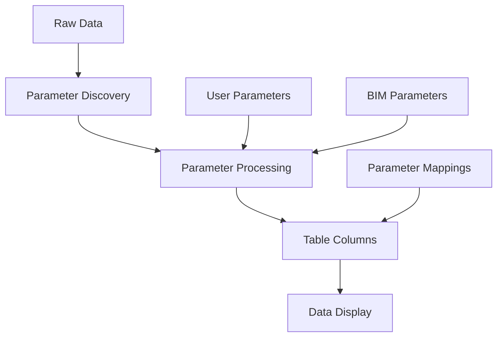
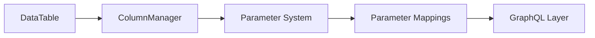
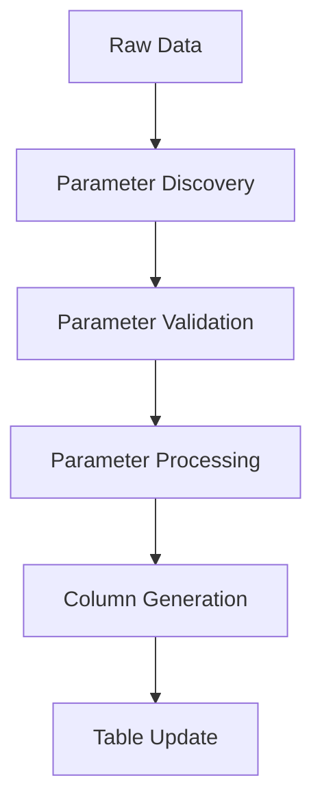

# Parameter System Architecture

## 1. Core Components & Data Flow



## 2. System Components

### Data Layer

```
ElementData
├── id: string
├── parameters: Record<string, unknown>
└── metadata: Record<string, unknown>
```

### Parameter Types

```typescript
interface Parameter {
  id: string
  field: string
  name: string
  type: string
  header?: string
  visible?: boolean
  removable?: boolean
}

interface BimParameter extends Parameter {
  sourceValue: unknown
  fetchedGroup: string
  currentGroup: string
}

interface UserParameter extends Parameter {
  equation: string
  category: string
}
```

### Table Structure

```typescript
interface TableConfig {
  id: string
  name: string
  columns: ColumnDef[]
  parameters: Parameter[]
}

interface ColumnDef {
  id: string
  field: string
  header: string
  type: string
  visible: boolean
  parameterRef?: string
}
```

## 3. Component Relationships

### Core Components



### Parameter Processing Flow



## 4. State Management

### Parameter State

```typescript
interface ParameterState {
  definitions: Record<string, Parameter>
  mappings: ParameterMappings
  processed: Record<string, ProcessedParameter>
}
```

### Table State

```typescript
interface TableState {
  columns: ColumnDef[]
  visibleColumns: ColumnDef[]
  data: ElementData[]
  processedData: ElementData[]
}
```

## 5. Current Organization

### Core Parameter System

```
frontend-2/
└── composables/
    └── core/
        ├── parameters/
        │   ├── useParametersState.ts     # State management
        │   ├── useParameterOperations.ts # CRUD operations
        │   ├── useParameterEvaluation.ts # Value evaluation
        │   ├── useParameterForm.ts       # Form handling
        │   ├── useParameterGroups.ts     # Group management
        │   ├── useParameterUtils.ts      # Utility functions
        │   ├── useParameters.ts          # Main functionality
        │   ├── constants.ts              # Fixed parameters
        │   └── index.ts                  # Clean exports
        └── tables/
            ├── useTableSelection.ts      # Table selection
            ├── useParameterColumns.ts    # Column conversion
            └── index.ts                  # Table exports
```

### Viewer-Specific Components

```
frontend-2/
└── composables/
    └── viewer/
        └── parameters/
            ├── useBIMParameters.ts     # BIM parameter handling
            ├── useParameterMapping.ts  # Parameter mapping
            └── index.ts               # Viewer exports
```

## 6. Key Features

### Error Handling

Each module includes dedicated error types:

```typescript
export class ParameterOperationError extends Error {}
export class ParameterEvaluationError extends Error {}
export class ParameterFormError extends Error {}
export class ParameterGroupError extends Error {}
export class ParameterUtilsError extends Error {}
export class TableSelectionError extends Error {}
```

### Debug Logging

Comprehensive debug logging using categories:

```typescript
enum DebugCategories {
  PARAMETERS = 'parameters',
  PARAMETER_VALIDATION = 'parameter-validation',
  PARAMETER_UPDATES = 'parameter-updates',
  TABLE_DATA = 'table-data',
  TABLE_UPDATES = 'table-updates',
  TABLE_VALIDATION = 'table-validation'
}
```

### Parameter Constants

Fixed parameter definitions:

```typescript
export const PARAMETER_CATEGORIES = {
  CLASSIFICATION: 'Classification',
  DIMENSIONS: 'Dimensions',
  CUSTOM: 'Custom'
} as const

export const PARAMETER_TYPES = {
  STRING: 'string',
  NUMBER: 'number',
  BOOLEAN: 'boolean',
  DATE: 'date',
  OBJECT: 'object',
  ARRAY: 'array'
} as const
```

## 7. Implementation Considerations

1. Performance:

   - Parameter discovery optimized
   - Processing results cached
   - State updates batched
   - Lazy loading where possible

2. Type Safety:

   - Strong typing throughout
   - Runtime type validation
   - Error boundaries defined
   - Type guards implemented

3. Extensibility:

   - Plugin architecture for parameters
   - Custom parameter types supported
   - Processing pipeline extensible
   - State management modular

4. Maintainability:

   - Clear component boundaries
   - Documented interfaces
   - Testable units
   - Consistent patterns

5. Error Handling:

   - Dedicated error types per module
   - Consistent error propagation
   - Error recovery strategies
   - User-friendly error messages

6. Debugging:
   - Comprehensive debug logging
   - State tracking
   - Performance monitoring
   - Error tracing
