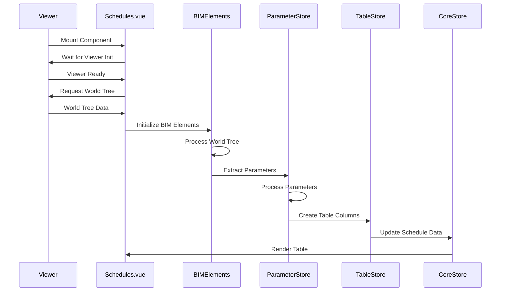
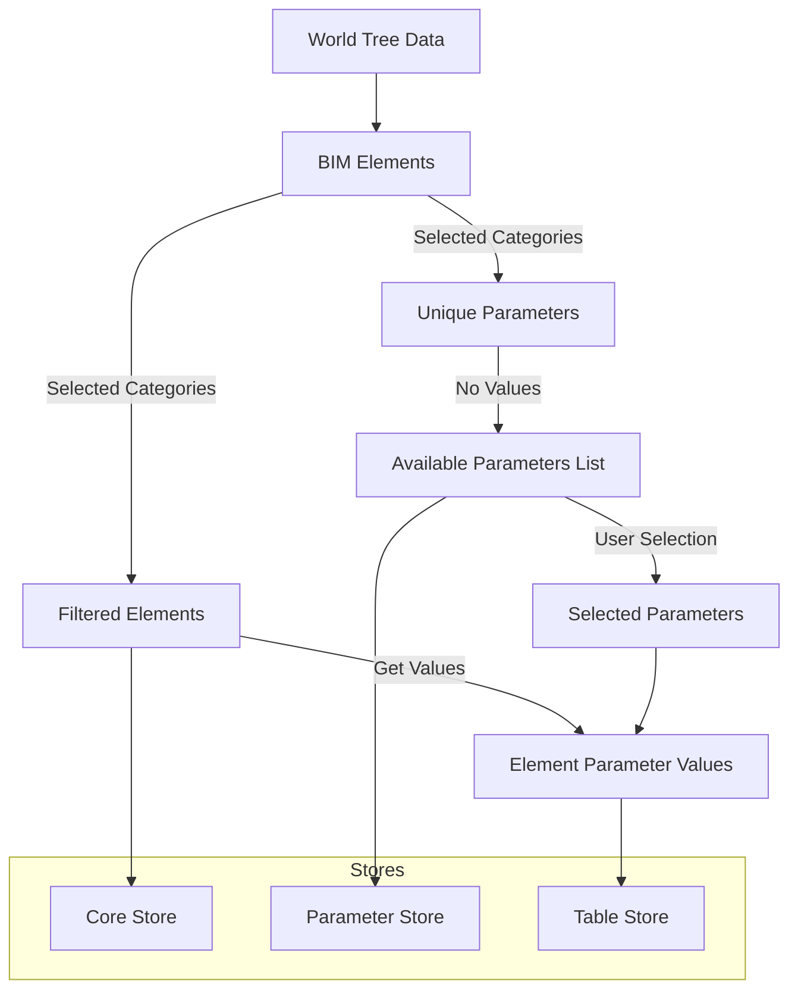
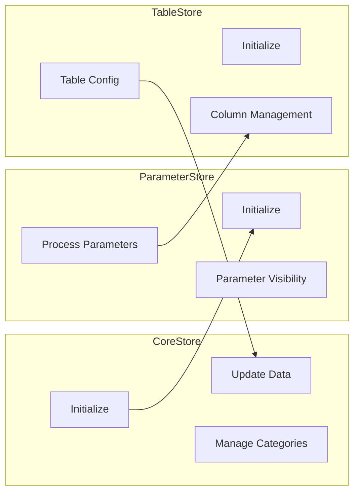
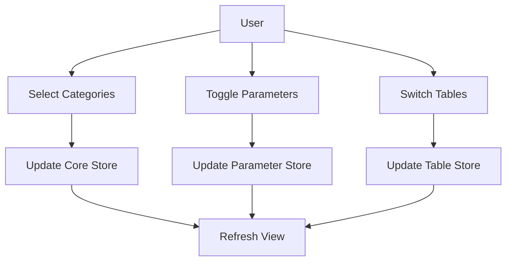

# Schedules System Flow

## 1. Component Structure

```
Schedules.vue (Main Component)
├── TableLayout
│   └── LoadingState
│       └── ScheduleMainView (Main Table UI)
└── ViewerLayoutPanel

Composables (State Management)
├── useStore (Core Store)
├── useParameterStore (Parameter Management)
├── useTableStore (Table Configuration)
└── useElementsData (BIM Data Processing)
```

## 2. Initialization Sequence



## 3. Data Flow



## 3.1 Two-Phase Parameter Processing

1. **Phase 1: Parameter Discovery**

   - Filter BIM elements by selected categories (parent/child)
   - Extract unique parameters from filtered elements
   - Create separate parameter lists:
     - Parent categories parameters
     - Child categories parameters
   - Parameters at this stage have no values
   - Store available parameters in ParameterStore
   - User selects which parameters to display

2. **Phase 2: Value Collection**
   - Filter elements by selected categories again
   - For each filtered element:
     - Get values only for selected parameters
     - Same parameter can have different values in different elements
     - Store element data with parameter values
   - Create table rows combining:
     - Element metadata (id, type, etc.)
     - Selected parameter values for that element

Example Flow:

```
Phase 1 (Parameter Discovery):
Parent Categories (Walls):
  - Available Parameters:
    * Parameters.Type
    * Parameters.Family
    * Parameters.Area
    * Parameters.Volume
  - User Selects:
    * Parameters.Type
    * Parameters.Area

Child Categories (Structural Framing):
  - Available Parameters:
    * Parameters.Profile
    * Parameters.Length
    * Parameters.Material
  - User Selects:
    * Parameters.Length
    * Parameters.Material

Phase 2 (Value Collection):
Parent Elements:
  Wall-1:
    - Parameters.Type: "Basic Wall"
    - Parameters.Area: 2.5
  Wall-2:
    - Parameters.Type: "Basic Wall"
    - Parameters.Area: 3.7

Child Elements:
  Beam-1:
    - Parameters.Length: 4000
    - Parameters.Material: "Steel"
  Beam-2:
    - Parameters.Length: 3500
    - Parameters.Material: "Steel"
```

## 4. Store Interactions



## 5. User Interactions



## 6. State Dependencies

```
CoreStore
├── scheduleData (BIM Elements)
├── selectedCategories
└── tableConfiguration

ParameterStore
├── availableParameters
├── selectedParameters
└── parameterVisibility

TableStore
├── tableConfig
├── columnStates
└── currentTable
```

## 7. Critical Points

1. **Initialization Order**

   - Viewer must be ready
   - World tree must be populated
   - BIM elements must be processed
   - Parameters must be extracted
   - Tables must be configured

2. **Data Dependencies**

   - Table columns depend on processed parameters
   - Parameter visibility affects table display
   - Category selection affects available data

3. **State Synchronization**
   - Store updates must be coordinated
   - UI updates must wait for data
   - User interactions must trigger proper updates

## 8. Common Issues

1. **Race Conditions**

   - Stores initializing before data is ready
   - UI rendering before stores are ready
   - Multiple store updates conflicting

2. **Data Consistency**

   - Parameters not matching BIM elements
   - Table columns not matching parameters
   - Category filters not updating properly

3. **Performance**
   - Large data sets causing slow processing
   - Multiple store updates causing re-renders
   - Complex data transformations blocking UI

## 9. Proposed Solutions

1. **Initialization**

   - Implement proper initialization sequence
   - Add verification steps between phases
   - Use loading states effectively

2. **Data Flow**

   - Ensure unidirectional data flow
   - Implement proper error boundaries
   - Add data validation steps

3. **State Management**

   - Coordinate store updates
   - Implement proper watchers
   - Add state recovery mechanisms

4. **User Experience**
   - Show proper loading states
   - Provide clear error messages
   - Implement proper UI feedback

## Next Steps

1. Review and verify this flow diagram
2. Identify any missing components or interactions
3. Determine where the current implementation deviates
4. Create a plan to align implementation with this flow
